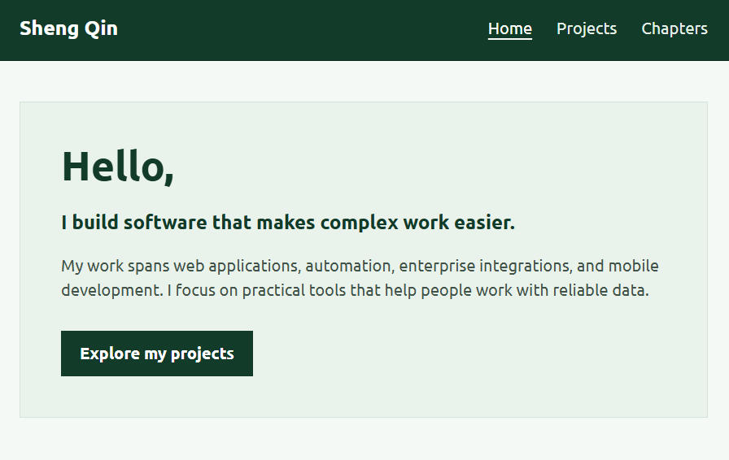

# Sheng Qin's Personal Homepage

A static portfolio for CS5610 Web Development. It introduces my background, explains selected software projects, and connects education with project milestones through an interactive timeline.

- **Author:** [Sheng Qin](https://github.com/infiniwire)
- **Course:** [CS5610 Web Development](https://northeastern.instructure.com/courses/261032)
- **Live site:** [infiniwire.github.io/CS5610-P1](https://infiniwire.github.io/CS5610-P1/)

## Project objective

The site helps visitors understand the kinds of software I build and what I contributed to each project. It is a front-end-only site made with HTML5, CSS3, and ES6 modules. It uses no back-end service, component library, or jQuery.

## Pages

| Page                      | Purpose                                                                                                                                          |
| ------------------------- | ------------------------------------------------------------------------------------------------------------------------------------------------ |
| [Home](index.html)        | Introduces me, the tools I use, and my education.                                                                                                |
| [Projects](projects.html) | Summarizes five projects and lets visitors search by tool or technology. Each card explains my contribution and includes available public links. |
| [Chapters](fusion.html)   | Uses a keyboard-accessible year slider to show education and single-year project milestones from 2020 to 2026.                                   |

## Custom search

The Projects page includes a live search bar for finding projects by their tools and technologies. Its JavaScript is in the separate ES6 module [`js/projects.js`](js/projects.js). The code uses ordinary `for` loops, `if` statements, and descriptive variables to keep the filtering logic easy to follow. It reads the tool labels already displayed on each card, without a search library or a separate copy of the project data.

## Screenshot



## Run locally

There is no build step. From the repository root, start a local web server and open <http://localhost:8000/>:

```sh
python -m http.server 8000
```

On systems that use `python3` or `py` instead of `python`, use that command name. Serve the site over HTTP so the ES6 modules load as they do on GitHub Pages.

Node.js and npm are needed only for development checks:

```sh
npm ci
npm run lint
npm run format:check
```

The GitHub Actions workflow in `.github/workflows/publish-pages.yml` publishes the site files from `main` to GitHub Pages.

## Generative AI use

I used generative AI to help draft the site's written content. Chapters is the assignment's AI-generated third page. I supplied the education periods and project milestones, reviewed the generated output, revised the interaction and copy, and removed an illustration that did not fit the page.

I also used AI to create the GitHub Actions workflow that deploys this static website to GitHub Pages.

AI also helped implement the Projects tool search and simplify its JavaScript into basic loops and conditions. The search is separate from the Chapters timeline, but it was still developed with AI assistance.

**Tool:** ChatGPT \
**Model:** GPT-5.6 Sol High

### Prompts for the AI page

These prompts organize the original requests into generation and refinement steps. Some instructions were originally part of the same longer prompt. The wording below is streamlined, rather than a verbatim conversation transcript.

1. **Timeline concept**

   > Create an interactive portfolio page with a year slider. Show the selected year at the top, and update the education and project content to match that year.

2. **Year ruler reference**

   > Use my reference image for the year control: a large centered year, dense ruler ticks, a teal selection line, a circular drag handle, and year labels. Keep the slider keyboard accessible.

3. **Education and project dates**

   > Use these education periods: BCIT Diploma in Computer Systems Technology, 2020–2022; BCIT B.Sc. in Applied Computer Science, 2023–2025; Northeastern M.S. in Computer Science, 2025–2027, expected. Use these project milestones: CST Calendar App in 2020, Java Calculator in 2021, Ballard Customer Portal in 2023, LENZ Photo Gallery in 2024, and Order Entry and Sales Prediction in 2025. Treat projects as single-year milestones. Show an empty project state for 2022 and 2026 without inventing a project.

4. **Editorial layout**

   > Redesign Fusion as an editorial story that connects what I was learning with what I was building. Use dark green, cream, teal, Ubuntu typography, and sharp corners except for the slider handle. Preserve the site navigation and project facts. Make the page responsive. Edit only fusion.html, css/fusion.css, and js/fusion.js, using vanilla HTML, CSS, and ES6 modules. Do not commit or push.

5. **School and project summaries**

   > After the slider changes the year, show a short school introduction and a project summary alongside the matching education and project entries. Keep the descriptions consistent with the rest of the portfolio.

6. **Motion refinement**

   > Make the selected year feel like a distinct chapter. Highlight its ruler tick, move a subtle connector between education and project content, and reveal the updated text with a short transition. Keep the facts readable, respect prefers-reduced-motion, and check desktop and mobile layouts.

7. **Remove an unsuccessful visual experiment**

   > Remove the character illustration feature because it does not fit the page. Keep the year ruler and the education and project story.

8. **Final page name**

   > Rename the page from Fusion to Chapters and update the navigation label and page title.

### README generation prompt

The following is the summary of the request used to prepare this README:

> Write the README with a Generative AI use section. Include the author, course link, project objective, screenshot, local running instructions, and the prompts and how AI was used.

## License and assets

The original project code is available under the [MIT License](LICENSE). Devicon SVGs have their own license and attribution in [`assets/icons/`](assets/icons/SOURCES.md). Institutional logos and other third-party marks remain the property of their respective owners.
